# Web UI图形化界面指引

## 简介

为了方便直接使用本项目，我们设计了基于Vue.js(v0.1 vue版本)和React.js(v0.2 react及后续版本)的网页端图像化界面。

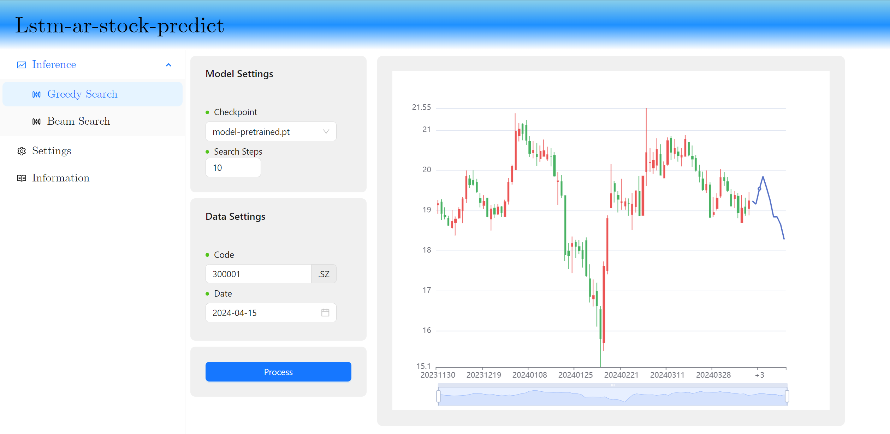

左侧为侧边栏，选择推理页面(Inference)、设置页面(Settings)和查看信息(Information)。推理页面支持贪婪搜索(Greedy Search)和波束搜索(Beam Search)模式，其数据字段如下：

- `checkpoint` 选择使用的模型
- `Search Steps` 设置向后预测推理天数
- `Beam Size` 波束搜索大小（仅`Beam Search`模式）
- `Code` 股票代码，六位代码，仅支持 `00/30/60/68`的A股股票
- `Date` 推理起始点，此日期及前90个交易日将用于模型输入。注意：请确保**所选的日期为开盘交易日**，否则将不会有结果。

举个例子，图中表示使用`model-pretrained.pth`模型对`300001`的股票进行贪婪搜索预测，模型将会以`2024-04-15`及其前90个交易日数据为基准，向后预测推理`10`个交易日的涨跌走势。

## 安装环境

### 下载源码

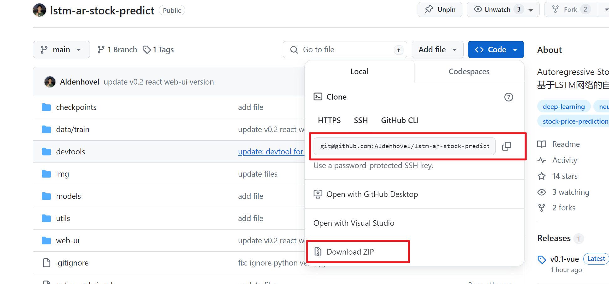

在Github中使用`git clone`或者直接下载项目zip解压，得到`lstm-ar-stock-predict/`目录。

### 安装Python环境及依赖模块

进入`lstm-ar-stock-predict/web-ui/venv/`，双击运行`install_py.bat`脚本，程序会自动安装临时Python环境（P.S.如果你开了VPN，建议先将它关掉，否则可能会下载失败）：

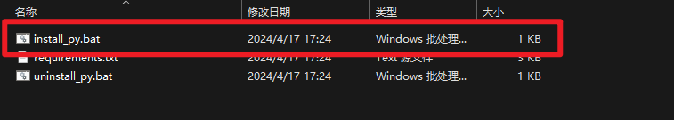

程序首先会从华为云下载`Python 3.7.5`，安装会弹出提示，使用默认设置点击`Install Now`安装，请耐心等待程序安装完成：

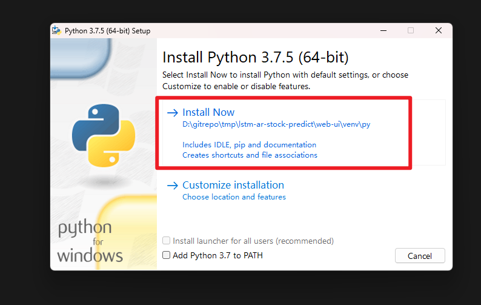

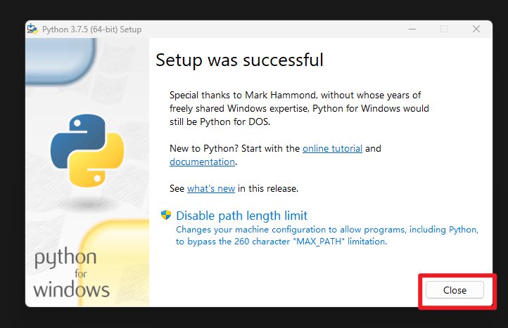

随后程序会更新`pip`和根据`requirements.txt`的信息安装依赖模块，请耐心等待下载：

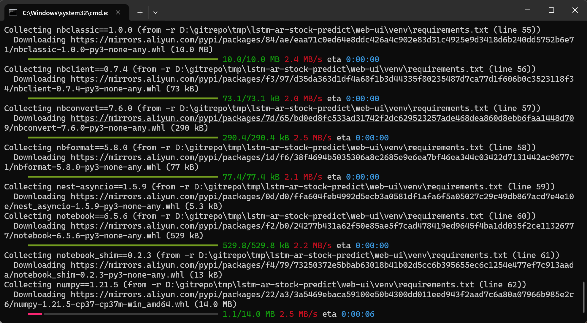

当一切就绪后，出现Done表示完成安装，临时环境的Python解释器会在`latm-ar-stock-predict/web-ui/venv/py/python.exe`：

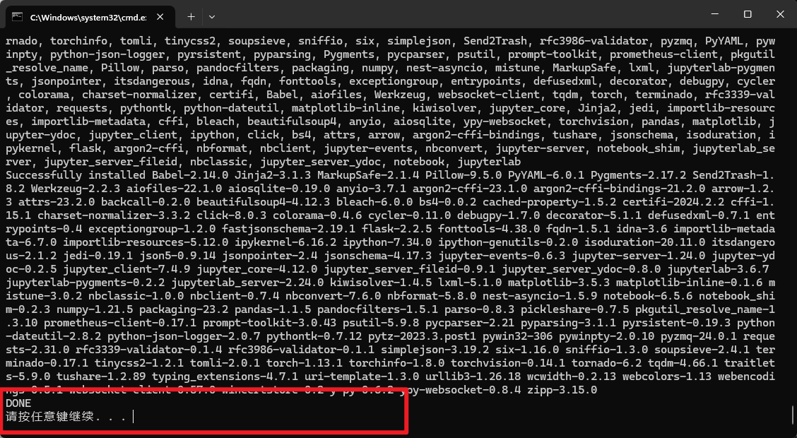

### 配置Tushare API

我们的项目需要从外部获取股票走势数据来完成预测，因此需要配置tushare库的连接token，tushare的官网为[tushare](https://tushare.pro/)，注册之后可以获得个人token，请妥善保存自己的token，将token复制：

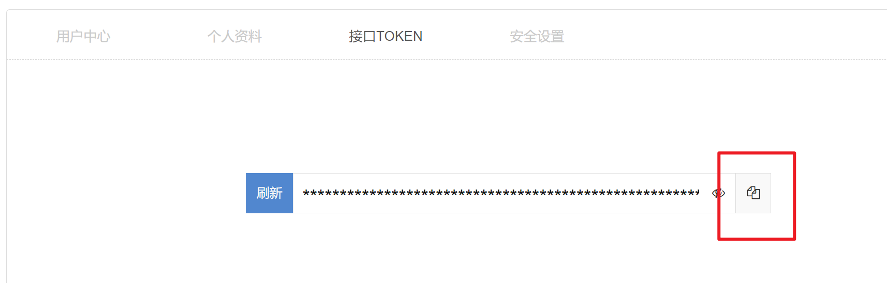

粘贴到`web-ui/config.json`中并保存：

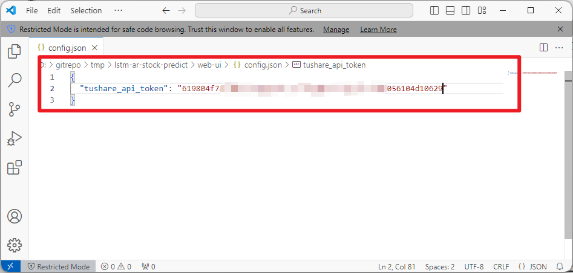

### 启动界面

双击`run-web-ui.bat`启动网页端界面：

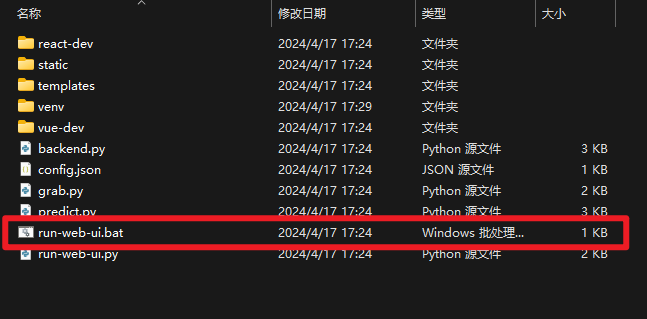

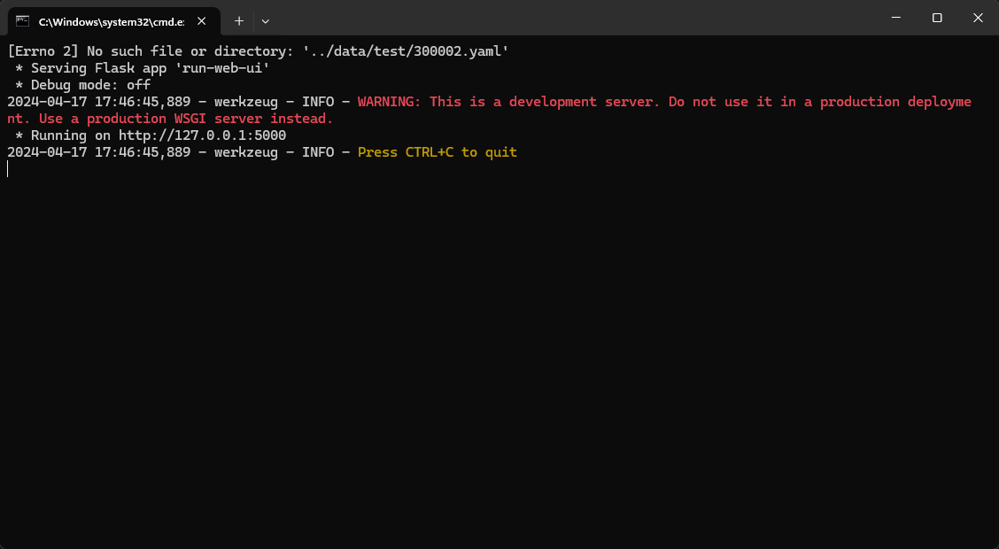

使用`ctrl` 并点击`http://127.0.0.1:5000`打开网页，即可愉快使用：

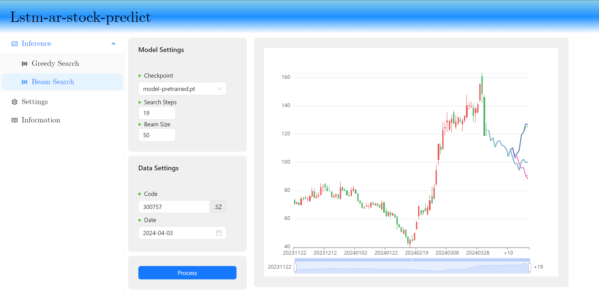

### 退出界面

在命令行中使用`ctrl+c`即可终止可视化界面。

## 卸载环境

当想要卸载本项目时，请不要直接删除目录，而是先卸载Python环境，双击`web-ui/venv/uninstall_py.bat`启动卸载脚本：

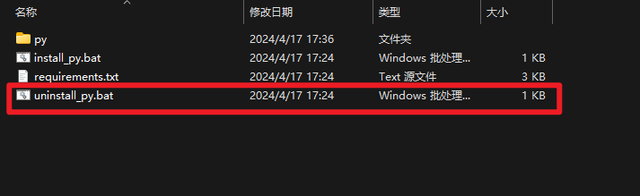

选择`Uninstall`选项，等待卸载完成：

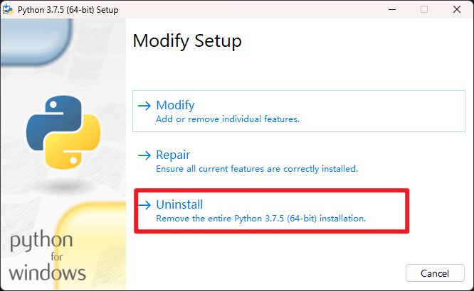

最后等脚本完成清理：

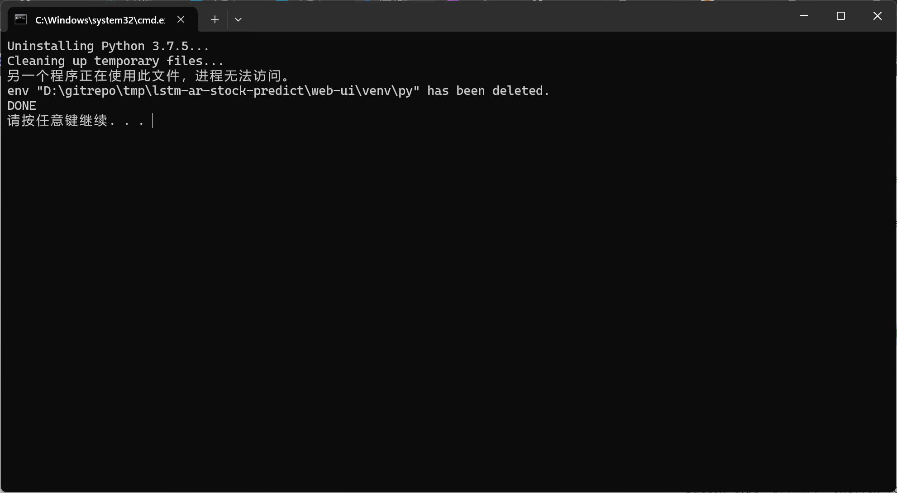

此时即可完整删除整个`lstm-ar-stock-predict/`目录。

