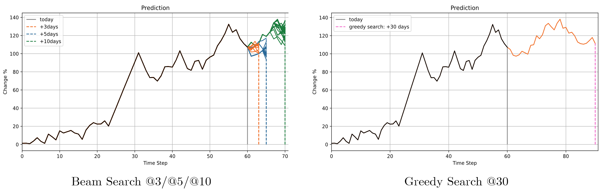
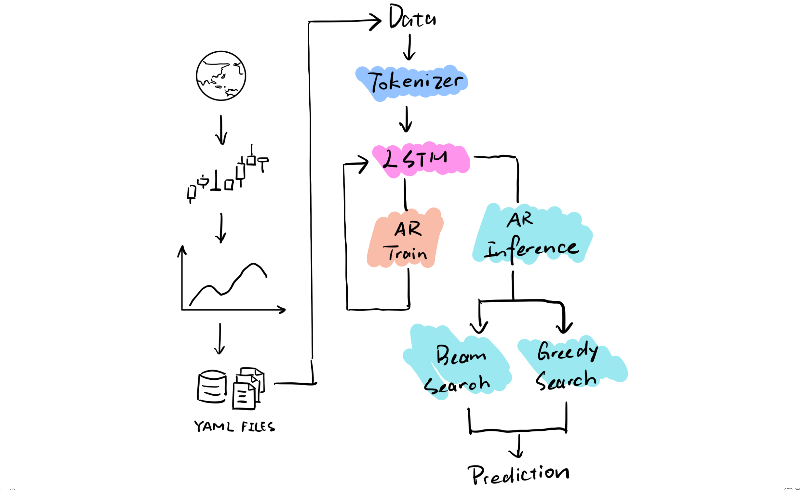
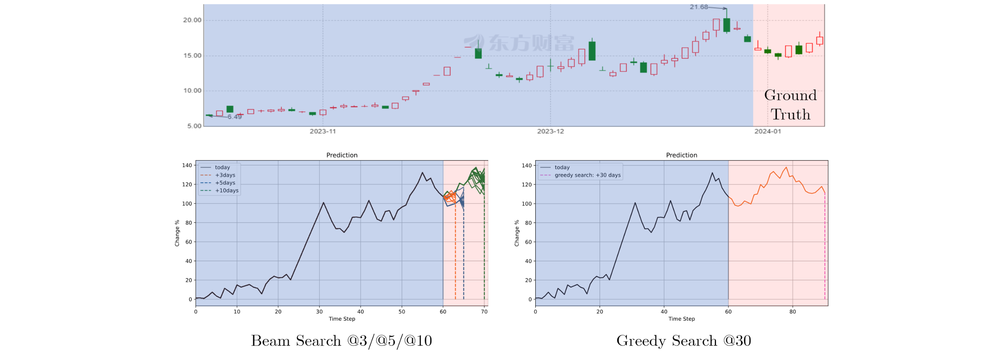
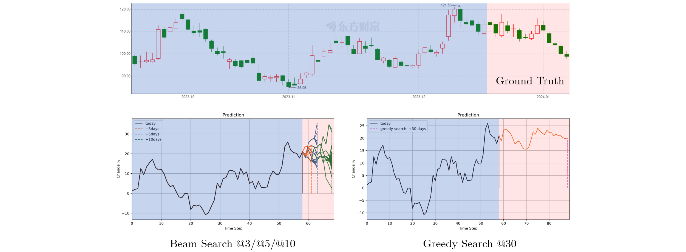
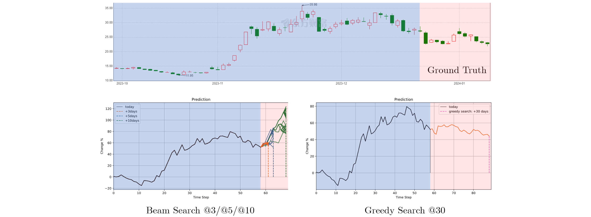

# LSTM 自回归股票预测

[](https://github.com/Naereen/badges/) [](https://www.python.org/) [](https://github.com)



<h4 align="center">
    <p>
        <b>中文</b> |
        <a href="https://github.com/Aldenhovel/lstm-ar-stock-predict/blob/main/readme_en.md">English</a> 
    <p>
</h4>


## 声明

1. 这个项目并非为了研究金融交易投资工具，实际上这是我研究 Image Caption 任务时突发奇想做的小玩具。

2. 在专业的金融分析中我了解到有相当多的基于机器学习的投研方法，这些方法具有更强的理论支撑，效果显而易见会更好。此模型完全没有经过金融领域的专业设计，仅仅是采用了自然语言处理的方法尝试解决问题。

3. 此项目在功能上并不完整（甚至在一些预测结果上违背直觉），距离一个成熟的金融预测模型还有很大差距，如果你有兴趣可以自己改进。

4. 此模型理论上可以应用于其他时序型自回归任务。


### 框架




## 数据

**训练数据** 在目录 `data/train/` 下有示例的训练数据，且需要解压。训练数据目录以时间区间为名，其下有大量 `yaml` 文件，每一个文件代表一个股票在某一段时间区间内的走势信息，包含以下字段：

- `date` 采集数据时间。
- `start` 该股票数据的起始时间。
- `end` 该股票数据的结束时间。
- `code` 该股票代码。
- `stdchange` 该股票在时间区间内的涨跌百分比情况列表。

**测试数据** 在目录 `data/test` 下有示例的测试数据，测试数据也是 `yaml` 文件，其内容格式与训练数据一致，但是直接存放在测试目录下。


## 模型

### Tokenizer

采用了网格化方式将连续区间离散化的形式将股票的涨跌幅映射到 `token id` ，设定涨跌幅有效区间为-10%~10%，分为100格，每格区间为0.2%，通过转换涨跌幅数值为所落在的区间为 `token id` 。此外由于`PAD` 占用了位置0，所有 `token id`需要后移一位。最后将 `token` 补充到相同长度，与原序列长度一起返回。

```python
from utils.Tokenizer import Tokenizer
tk = Tokenizer(grid=100, maxlen=10)

arr = [-9.81,  -1.05, -0.10, 5.26, 15.24]
tk.tokenize(arr)

>>
([1, 1, 45, 50, 77, 101, 0, 0, 0, 0], 5)
```

例如这里 -9.81 在(-10, -9.8] 属于区间0，右移一位得到 `token id` = 1；5.26 在 (5.2, 5.4] 属于区间26，右移一位得到 `token id` = 27；15.24超出了区间因此取区间100，右移一位得到 `token id` = 101。

### LSTM解码器

对于 LSTM 解码器的模型定义在于 `models/LSTMDecoder.py` 中，可以修改其参数实现量化模型大小。训练之后的模型保存至 `checkpoints` 中，我们提供了一个预训练的模型 `model-pretrained.pt` 可以直接使用。

### 推理模块

LSTM的自回归生成式推理过程与训练有点不同，需要融合搜索策略，这里提供了贪婪搜索和波束搜索两种。

**贪婪搜索** 每次将当前阶段概率最大者作为预测结果，直到搜索结束，最后会生成1个预测结果。

**波束搜索** 每次维护一个大小为 `beam_size` 的候选群，直到搜索结束，最后会生成 `beam_size` 个预测结果。


## 使用

### 环境

```
tushare==1.2.89
torch==1.13.1
pyyaml==6.0.1
torchinfo==1.8.0
numpy-base=1.21.5=py37hca35cd5_3
tqdm==4.66.1
matplotlib==3.5.3
```

### 训练与推理

参考 `main.ipynb` 中的示例。

### 获取测试样本

参考 `get_sample.ipynb` 中的示例。


## 结果示例



<hr/>



<hr/>



\* @N 表示向后推理N步。