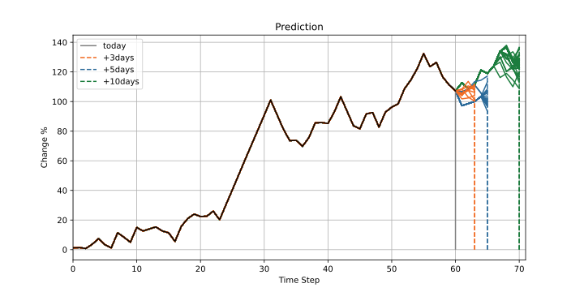

# LSTM Auto Regression Stock Predict

## 声明

- 这个项目并非为了研究金融交易投资工具，实际上这是我研究Image Caption任务时突发奇想做的小玩具。
- 在专业的金融分析中我了解到有相当多的基于机器学习的投研方法，这些方法具有更强的理论支撑，效果显而易见会更好。此模型完全没有经过金融领域的专业设计，仅仅是采用了自然语言处理的方法尝试解决问题。
- 此项目在功能上并不完整（甚至在一些预测结果上违背直觉），距离一个成熟的金融预测模型还有很大差距，如果你有兴趣可以自己改进。
- 此模型理论上可以应用于其他时序型自回归任务。

