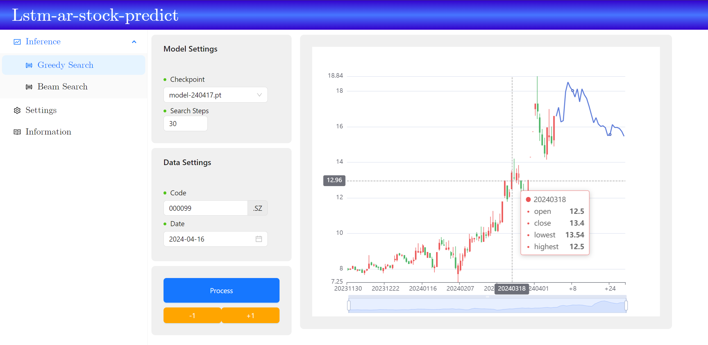

# LSTM 自回归股票预测

[](https://github.com/Naereen/badges/) [](https://www.python.org/) [](https://github.com)


## 0 声明

这个项目并非为了研究金融交易投资工具，实际上这是我研究 Image Caption 任务时突发奇想做的小玩具。因为没有经过经济学或者投资策略上的专业设计，效果不好很正常，你可以自己改进。


## 1 框架


## 2 数据

**训练数据** 在目录 `data/train/` 下有示例的训练数据，且需要解压。训练数据目录以时间区间为名，其下有大量 `yaml` 文件，每一个文件代表一个股票在某一段时间区间内的走势信息，包含以下字段（旧版的数据仅包含`date` `end` `code` `stdchange` 四个字段，但不影响训练，新的`v0.2`版本在采集时会包含所有字段）：

- `date: string` 采集数据时间。
- `end: string` 该股票数据的结束时间。
- `code: string` 该股票代码。
- `stdchange: <float>` 该股票在时间区间内的涨跌百分比情况列表。
- `open: <float>` 该股票开盘价。
- `close: array<float>` 该股票收盘价。
- `high: array<float>` 该股票最高价。
- `low: array<float>` 该股票最低价。
- `tradedate: array<string>` 历史交易日数据。

**测试数据** 在目录 `data/test` 下有示例的测试数据，测试数据也是 `yaml` 文件，其内容格式与训练数据基本一致。


## 3 模型

### 3.1 Tokenizer

采用了网格化方式将连续区间离散化的形式将股票的涨跌幅映射到 `token id` ，设定涨跌幅有效区间为-10%~10%，分为100格，每格区间为0.2%，通过转换涨跌幅数值为所落在的区间为 `token id` 。此外由于`PAD` 占用了位置0，所有 `token id`需要后移一位。最后将 `token` 补充到相同长度，与原序列长度一起返回。

```python
from utils.Tokenizer import Tokenizer
tk = Tokenizer(grid=100, maxlen=10)

arr = [-9.81,  -1.05, -0.10, 5.26, 15.24]
tk.tokenize(arr)

>>
([1, 1, 45, 50, 77, 101, 0, 0, 0, 0], 5)
```

例如这里 -9.81 在(-10, -9.8] 属于区间0，右移一位得到 `token id` = 1；5.26 在 (5.2, 5.4] 属于区间26，右移一位得到 `token id` = 27；15.24超出了区间因此取区间100，右移一位得到 `token id` = 101。

### 3.2 LSTM解码器

对于 LSTM 解码器的模型定义在于 `models/LSTMDecoder.py` 中，可以修改其参数实现量化模型大小。训练之后的模型保存至 `checkpoints/` 中，我们提供了一个预训练的模型 `model-pretrained.pt` 可以直接使用。

### 3.3 推理模块

LSTM的自回归生成式推理过程与训练有点不同，需要融合搜索策略，这里提供了贪婪搜索和波束搜索两种。

**贪婪搜索** 每次将当前阶段概率最大者作为预测结果，直到搜索结束，最后会生成1个预测结果。

**波束搜索** 每次维护一个大小为 `beam_size` 的候选群，直到搜索结束，最后会生成 `beam_size` 个预测结果。


## 4 在Pycharm中开发

### 4.1 安装环境

Pycharm集成了多种Python环境的支持，您可以根据需求搭建Anaconda或者Python virtual environment(venv)环境，具体方法参考5.1或6.1章节。

当环境安装好后，在`Files-settings-Project:...-Python Interpreter`中使用配置好的conda或venv环境。


## 5 在Jupyter中开发

### 5.1 安装Anaconda环境

我们建议使用Anaconda来创建运行环境，并使用Jupyter Notebook/Lab进行深度学习模型的研究。

```shell
conda create -n tmp python==3.7
conda activate tmp
```

```shell
cd lstm-ar-stock-predict
pip install -r requirements.txt -i https://mirrors.aliyun.com/pypi/simple
```

### 5.2 API配置

由于原版的开放 tushare API 已失效，现在需要新的 tushare pro API 来抓取数据，请到 [tushare 官网](https://tushare.pro/)注册申请。将 api token 复制到 `web-ui/config.json` 中。

### 5.3 训练与推理

参考 `main.ipynb` 中的示例。

### 5.4 获取测试样本

参考 `get_sample.ipynb` 中的示例。


## 6 使用图形化界面



请参考使用指引：[Web UI图形化界面指引 ](https://github.com/Aldenhovel/lstm-ar-stock-predict/blob/main/docs/quickstart.md) 。


## 7结果示例


\* @N 表示向后推理N步。数据均来自A股市场。


## A. Update

【2024/4/17】

>
>
>- 新增：使用**React.js重构了图形化界面**，现在更好用了！
>- 调整：图形界面中使用于可交互报表展示数据，不再使用图片形式。
>- 调整：将提供更多文档，集中于`doc/`下。
>- 删除：基于Vue.js的图形化界面暂停使用，但会保存在`release v0.1 vue`版本中作为历史版本存档。后续开发都将基于React.js。

【2024/4/7】

>
>
>- 调整：目录结构`gui`->`web-ui`。
>- 新增：在`web-ui`中使用bat脚本**一键构造venv环境**（这是为了方便直接用户使用，假如您想要研发改进，我依然推荐配置anaconda环境并使用jupyter模式）。

【2024/2/23】

>
>
>- 升级了爬虫，增加对 tushare pro API 的支持，请看 `使用——API配置` 。
>- 旧版的数据 API 已失效，因此删除了无效的代码。
>- 优化了数据样本形式。


## B. Repo Status

**B.1 Star History:**


**B.2 Visitor Count:**

