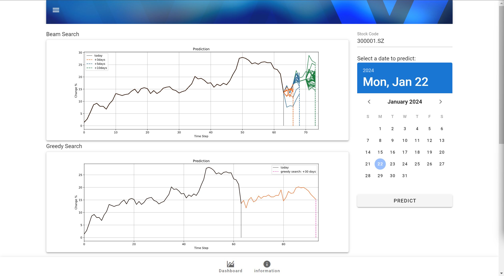

# LSTM Autoregressive Stock Predict

[](https://github.com/Naereen/badges/) [](https://www.python.org/) [](https://github.com)


<h4 align="center">
    <p>
        <a href="https://github.com/Aldenhovel/lstm-ar-stock-predict/blob/main/readme.md">中文</a> |
        <b>English</b> 
    <p>
</h4>


## Declaration

This project is not to study financial trading investment tools. In fact, it is a small toy that I made on a whim when I was studying the Image Caption task. Because it has not been professionally designed in terms of economics or investment strategies, it is normal for the results to be poor, and you can improve it yourself.


## Framework


## Data

**Training data** There is sample training data in the directory `data/train/` and needs to be decompressed. The training data directory is named after the time interval, and there are a large number of `yaml` files under it. Each file represents the trend information of a stock within a certain period of time, and contains the following fields:

- `date` Data collection time.
- `start` The starting time of the stock data.
- `end` The end time of the stock data.
- `code` The stock code.
- `stdchange` List of percentage increases and decreases of the stock within the time interval.

**Test data** There is sample test data in the directory `data/test`. The test data is also a `yaml` file. Its content format is the same as the training data, but it is stored directly in the test directory.


## Model

### Tokenizer

The grid method is used to discretize the continuous interval to map the stock's rise and fall to `token id`. The effective range of the rise and fall is set to -10%~10%, which is divided into 100 grids. Each grid range is 0.2%, by converting the increase and decrease value into the range it falls in as `token id`. In addition, since `PAD` occupies position 0, all `token ids` need to be shifted back by one. Finally, `token` is supplemented to the same length and returned together with the original sequence length.

```python
from utils.Tokenizer import Tokenizer
tk = Tokenizer(grid=100, maxlen=10)

arr = [-9.81,  -1.05, -0.10, 5.26, 15.24]
tk.tokenize(arr)

>>
([1, 1, 45, 50, 77, 101, 0, 0, 0, 0], 5)
```

For example, here -9.81 belongs to the interval 0 in (-10, -9.8], and is shifted one position to the right to get `token id` = 1; 5.26 is in (5.2, 5.4] and belongs to the interval 26, and is shifted one position to the right to get `token id` = 27 ; 15.24 exceeds the interval, so take the interval 100, shift one position to the right to get `token id` = 101.

### LSTM Decoder

The model definition for the LSTM decoder is in `models/LSTMDecoder.py`, and its parameters can be modified to achieve quantized model size. The trained model is saved to `checkpoints` training, and we provide a pre-trained model `model-pretrained.pt` that can be used directly.

### Inference Module

The autoregressive generative reasoning process of LSTM is a bit different from training and requires a fusion search strategy. Greedy search and beam search are provided here.

**Greedy Search** Each time, the one with the highest probability in the current stage is used as the prediction result until the search ends, and finally one prediction result will be generated.

**Beam search** maintains a candidate group of size `beam_size` each time until the search ends, and finally generates `beam_size` prediction results.


## Instructions

### Requirements

We recommend using Anaconda to create this runtime environment.

```` shell
conda create -n tmp python==3.7
````

```` shell
cd lstm-ar-stock prediction
python install -rrequirements.txt -i https://mirrors.aliyun.com/pypi/simple
````

### Training and inference

See the examples in `main.ipynb`.

### Get test samples

See the example in `get_sample.ipynb`.


## Example of results


<hr/>


<hr/>


\* @N means infer N steps .

## Use graphical interface



We designed the front-end and back-end interactive interface using Flask under `gui/`. Run

```shell
cd gui/
python run_gui.py
```

Please click the display link or open it manually in the browser.

## Star History

[](https://star-history.com/#aldenhovel/lstm-ar-stock-predict&Date)