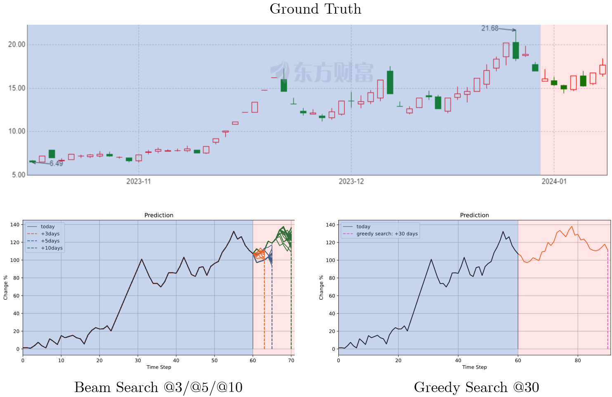

# LSTM Auto Regression Stock Predict


<h4 align="center">
    <p>
        <a href="https://github.com/Aldenhovel/lstm-ar-stock-predict/blob/main/readme.md">简体中文</a> |
        <b>English</b> 
    <p>
</h4>

## Declaration

1. This project is not to study financial trading investment tools. In fact, it is a small toy that I made on a whim when I was studying the Image Caption task.

2. In professional financial analysis, I learned that there are quite a few investment research methods based on machine learning. These methods have stronger theoretical support and the results are obviously better. This model has not been professionally designed in the financial field at all. It just uses natural language processing methods to try to solve the problem.

3. This project is not functionally complete (even some prediction results are counterintuitive), and it is still far from a mature financial prediction model. If you are interested, you can improve it yourself.

4. This model can theoretically be applied to other temporal autoregressive tasks.


## Data

**Training data** There is sample training data in the directory `data/train/` and needs to be decompressed. The training data directory is named after the time interval, and there are a large number of `yaml` files under it. Each file represents the trend information of a stock within a certain period of time, and contains the following fields:

- `date` Data collection time.
- `start` The starting time of the stock data.
- `end` The end time of the stock data.
- `code` The stock code.
- `stdchange` List of percentage increases and decreases of the stock within the time interval.

**Test data** There is sample test data in the directory `data/test`. The test data is also a `yaml` file. Its content format is the same as the training data, but it is stored directly in the test directory.


## Model

### Tokenizer

The grid method is used to discretize the continuous interval to map the stock's rise and fall to `token id`. The effective range of the rise and fall is set to -10%~10%, which is divided into 100 grids. Each grid range is 0.2%, by converting the increase and decrease value into the range it falls in as `token id`. In addition, since `PAD` occupies position 0, all `token ids` need to be shifted back by one. Finally, `token` is supplemented to the same length and returned together with the original sequence length.

```python
from utils.Tokenizer import Tokenizer
tk = Tokenizer(grid=100, maxlen=10)

arr = [-9.81,  -1.05, -0.10, 5.26, 15.24]
tk.tokenize(arr)

>>
([1, 1, 45, 50, 77, 101, 0, 0, 0, 0], 5)
```

For example, here -9.81 belongs to the interval 0 in (-10, -9.8], and is shifted one position to the right to get `token id` = 1; 5.26 is in (5.2, 5.4] and belongs to the interval 26, and is shifted one position to the right to get `token id` = 27 ; 15.24 exceeds the interval, so take the interval 100, shift one position to the right to get `token id` = 101.

### LSTM Decoder

The model definition for the LSTM decoder is in `models/LSTMDecoder.py`, and its parameters can be modified to achieve quantized model size.

### Inference Module

The autoregressive generative reasoning process of LSTM is a bit different from training and requires a fusion search strategy. Greedy search and beam search are provided here.

**Greedy Search** Each time, the one with the highest probability in the current stage is used as the prediction result until the search ends, and finally one prediction result will be generated.

**Beam search** maintains a candidate group of size `beam_size` each time until the search ends, and finally generates `beam_size` prediction results.


## Instructions

### Requirements

```
tushare==1.2.89
torch==1.13.1
pyyaml==6.0.1
torchinfo==1.8.0
numpy-base=1.21.5=py37hca35cd5_3
tqdm==4.66.1
matplotlib==3.5.3
```

### training and inference

See the examples in `main.ipynb`.

### Get test samples

See the example in `get_sample.ipynb`.


## Example of results



